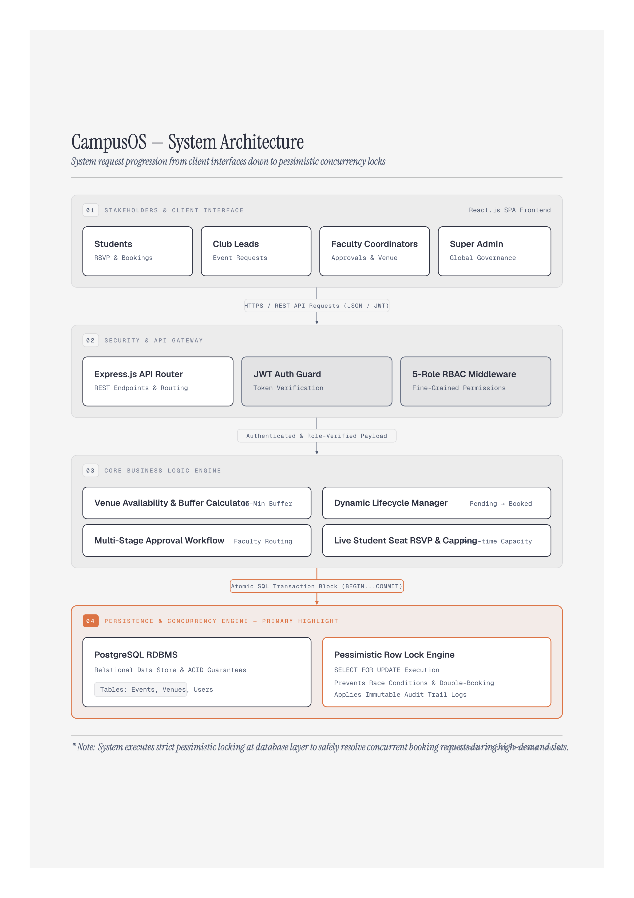

# 🏫 CampusOS — Campus Club & Event Management Platform

[](https://github.com/GgauravJ05/campusOS/actions/workflows/ci.yml)
[](https://github.com/GgauravJ05/campusOS/actions/workflows/release.yml)
[](LICENSE)
[](CODE_OF_CONDUCT.md)

> **What changed recently?** See [`UPDATES.md`](UPDATES.md) — every change and build, newest first.

> A unified, high-concurrency web platform designed to streamline campus club events, venue scheduling, student seat reservations, and administrative governance.

---

## 📌 Problem Statement

Colleges currently manage campus clubs, special interest groups (SIGs), venue allocations, and event notifications through fragmented, manual channels:
* **Venue Double-Bookings:** Club leads face frequent scheduling conflicts when requesting computer labs, seminar halls, and auditoriums during peak fest dates.
* **Communication Breakdown:** Students miss out on high-value workshops because notices are scattered across unorganized chat groups, with no mechanism to reserve seats for limited-capacity events.
* **Lack of Administrative Oversight:** Faculty and admins lack real-time visibility into venue availability, club governance, attendance metrics, and immutable administrative audit trails.

**CampusOS** solves this by unifying campus operations into a single transactional workflow:

> **Club Requests Venue** → **Admin Approves** → **Event Published** → **Students Book Seats** → **Reminders Fire**

---

## 🏛️ System Architecture & Pillar Breakdown
<p align="center">
  
</p>

---

## 🚀 Getting Started

**Prerequisites:** Node.js 24 LTS, and Docker (or a local PostgreSQL 15+).

```bash
git clone https://github.com/GgauravJ05/campusOS.git
cd campusOS

# 1. Database - schema and seed data are applied automatically
docker compose up -d

# 2. API
cd backend
cp .env.example .env      # edit JWT_SECRET
npm install
npm run dev               # http://localhost:5000

# 3. Web app (separate terminal)
cd frontend
npm install
npm run dev               # http://localhost:5173
```

Check the API is healthy:

```bash
curl localhost:5000/api/health         # process up
curl localhost:5000/api/health/ready   # database reachable too
```

> **macOS users:** port 5000 is taken by the AirPlay Receiver and returns
> `403` to everything. Disable it in *System Settings → General → AirDrop &
> Handoff*, or set a different `PORT` in `backend/.env`.

Seeded demo accounts all use the password `Campus@123`:

| Role                         | Email                          |
| ---------------------------- | ------------------------------ |
| Principal & HOD (Super Admin)| `principal@mmcoe.edu.in`       |
| Department Event Coordinator | `coordinator.it@mmcoe.edu.in`  |
| Club Head                    | `gaurav.jadhav@mmcoe.edu.in`   |
| Club Member                  | `aditya.patil@mmcoe.edu.in`    |
| Student                      | `srushti.mane@mmcoe.edu.in`    |

### Running the tests

```bash
cd backend
npm test              # unit + integration
npm run test:coverage # with the coverage gate
```

Unit tests need no database. The SQL-backed suites read `TEST_DATABASE_URL`
and skip themselves when it is unset, so the suite passes on a machine with
no PostgreSQL installed.

---

## 📁 Repository Layout

```
backend/     Express REST API - see backend/README.md
frontend/    React (Vite) single-page application
db/          schema.sql, seed.sql, reset.sql
docs/        SRS, diagrams, workflows, weekly reports
```

---

## 📚 Documentation

| Document              | Location                                              |
| --------------------- | ----------------------------------------------------- |
| Software Requirements | [`docs/src/`](docs/src/)                              |
| Use case diagram      | [`docs/diagrams/use_case.png`](docs/diagrams/use_case.png) |
| Database schema       | [`db/schema.sql`](db/schema.sql)                      |
| Backend guide         | [`backend/README.md`](backend/README.md)              |
| Workflows             | [`docs/workflows/`](docs/workflows/)                  |
| Change log / builds   | [`UPDATES.md`](UPDATES.md)                            |

---

## 🤝 Contributing

Read [`CONTRIBUTING.md`](CONTRIBUTING.md) before opening a pull request: branch
from `dev`, use Conventional Commits, keep CI green, and add an `UPDATES.md`
entry. Everyone is expected to follow the [Code of Conduct](CODE_OF_CONDUCT.md).
Security issues go through [`SECURITY.md`](SECURITY.md), never a public issue.

## 📄 License

[MIT](LICENSE) © 2026 Team A6, MMCOE.
