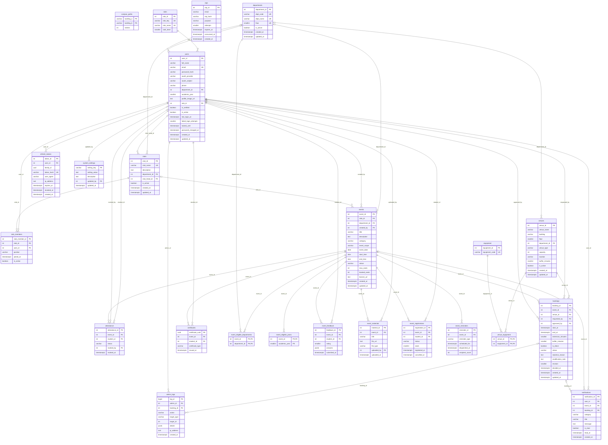

# CampusOS — ER diagram

Crow's-foot notation, **generated** from `db/schema.sql` by
`scripts/er-diagram/generate.mjs` (do not edit by hand; rerun the script after a
schema change). Rendered copies: `er-diagram.svg`, `er-diagram.png`.

24 tables, 38 foreign keys. `PK` primary key, `FK` foreign key,
`UK` unique on its own. A table with two `PK` columns has a composite primary key.
Line ends: `||` exactly one, `|o` zero or one, `o{` zero or many, `o|` zero or one
(one-to-one). The label on each line is the foreign-key column.

Views (`v_venue_utilisation`, `v_club_activity`, `v_event_attendance`,
`v_active_venues`) are not entities and are not drawn.

